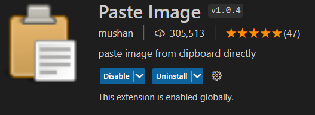

import Comment from '@/components/Comment';
import Header from '@/components/Header';
import "mafs/core.css";
import mafs from "mafs";
const { Mafs, Coordinates, Plot, Theme } = mafs;

# 연습 페이지

React 등 여러 기술 연습 공간입니다.

의미없는 멘트나 컴포넌트들이 노출될 수 있습니다.

<Header />

## Math
<Mafs>
    <Coordinates.Cartesian />
    <Plot.OfX y={Math.sin} color={Theme.blue} />
</Mafs>

<Comment />
