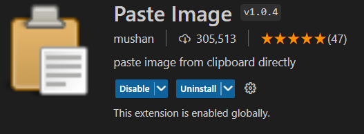

import Comment from '@/components/Comment';
import Header from '@/components/Header';
import HelloGraph from '@/components/HelloGraph';
import TagList from '@/components/TagList';
import 'katex/dist/katex.min.css';
import { InlineMath, BlockMath } from 'react-katex';

# 연습 페이지

React 등 여러 기술 연습 공간입니다.

의미없는 멘트나 컴포넌트들이 노출될 수 있습니다.

<InlineMath>\int_0^\infty x^2 dx</InlineMath>

<InlineMath math="\int_0^\infty x^2 dx"/>

<BlockMath>\int_0^\infty x^2 dx</BlockMath>

<BlockMath math="\int_0^\infty x^2 dx"/>

<Header />
<TagList />

## Table

| a | b  |  c |  d  |
| - | :- | -: | :-: |
| a | b  |  c |  d  |
| a | b  |  c |  d  |
| a | b  |  c |  d  |
| a | b  |  c |  d  |

## Tasklist

* [ ] to do
* [x] done

## Math
<HelloGraph />

<Comment />
